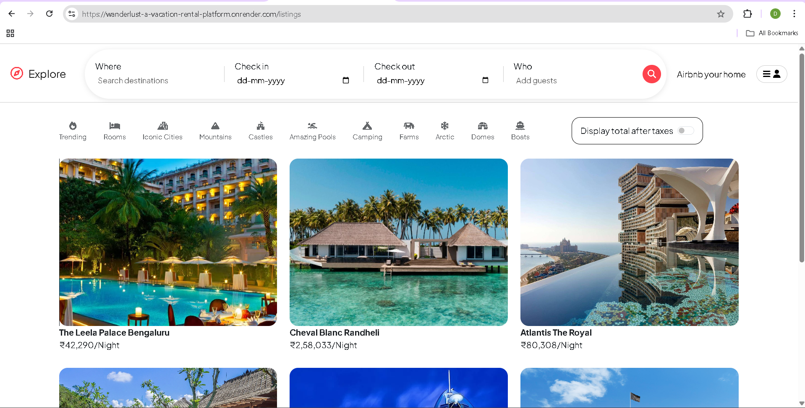
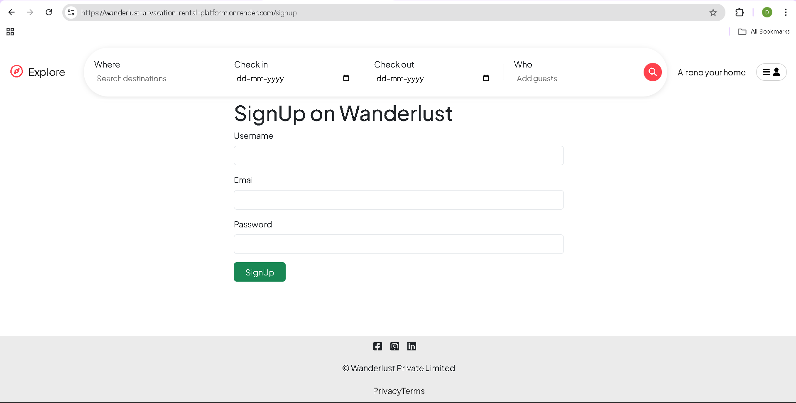
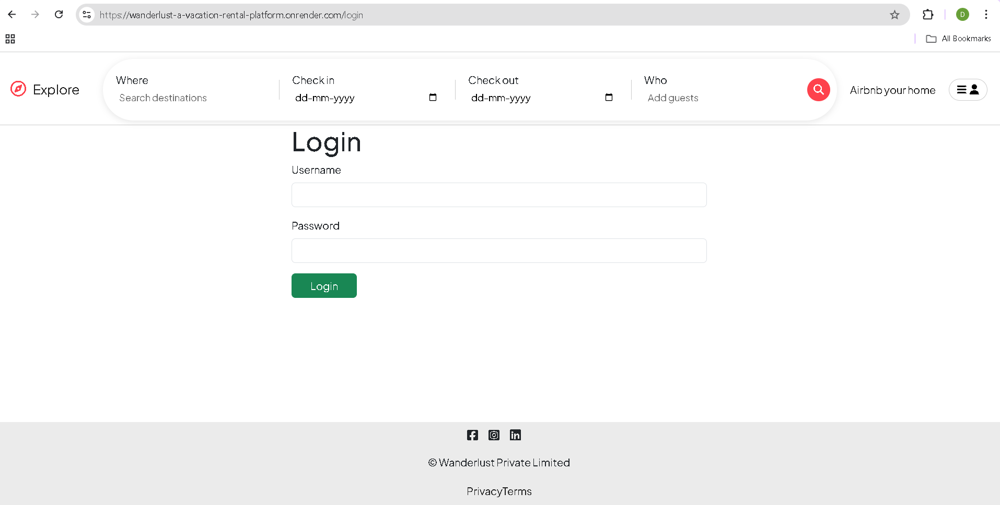
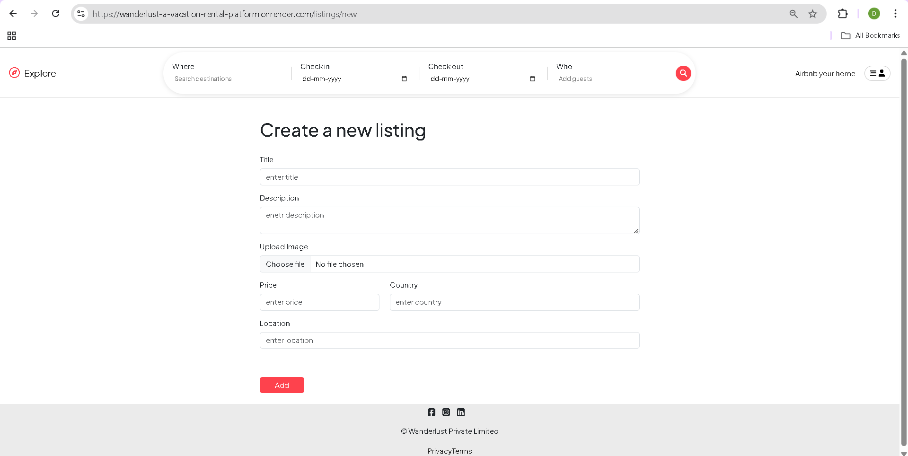
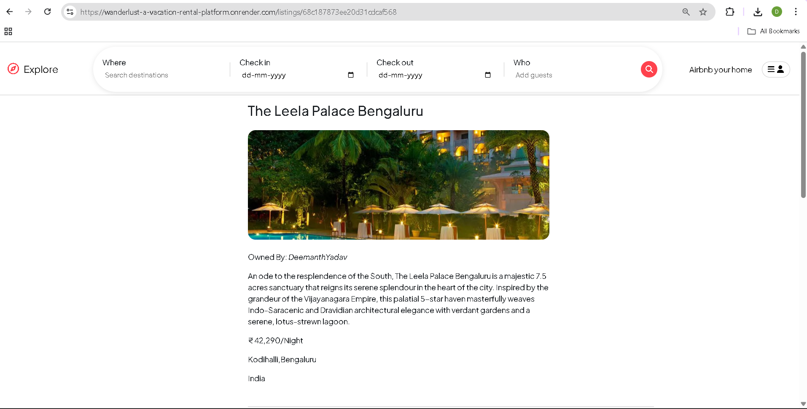
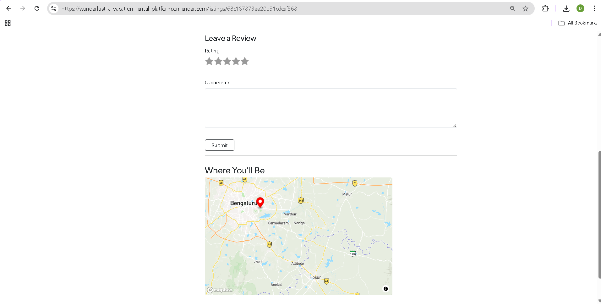
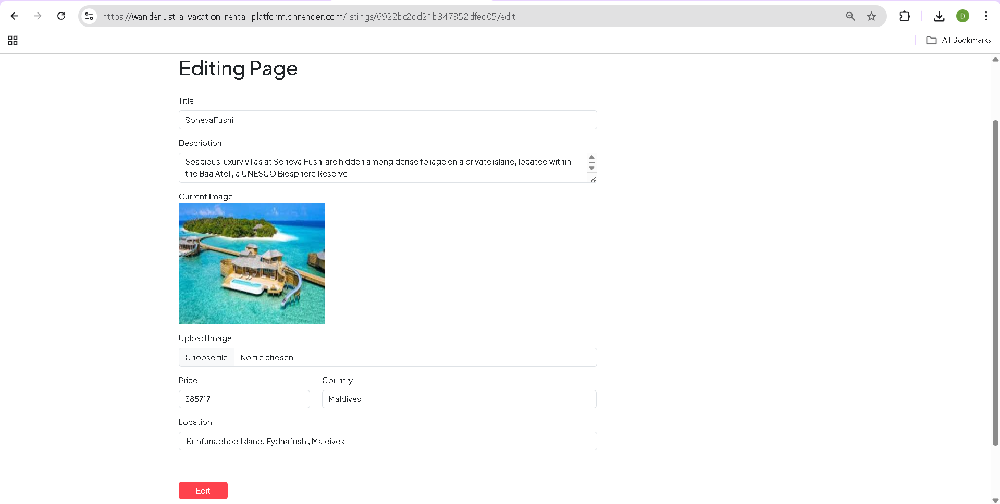

## Wanderlust 🏕️ – Airbnb Clone
A full-stack web application inspired by Airbnb, built with Node.js, Express, MongoDB, and EJS. Features user authentication, property listings, reviews, and interactive maps.

## 🚀 Features

**🔐 Authentication & Authorization**
- User registration and login
- Passport.js local authentication
- Session management with MongoDB store
- Protected routes and ownership verification

**🏠 Property Listings**
- Create, read, update, and delete property listings
- Image upload with Cloudinary integration
- Location-based searching with Mapbox geocoding
- Interactive maps showing property locations
- Filter listings by categories (Trending, Mountains, Castles, etc.)

**⭐ Reviews & Ratings**
- Leave reviews and star ratings for properties
- Review management (add/delete)
- Star rating system with custom CSS
- User-specific review permissions

**🗺️ Interactive Maps**
- Mapbox integration for property locations
- Interactive markers with property details
- Geocoding for address to coordinates conversion

**🎨 UI/UX Features**
- Responsive design with Bootstrap
- Custom rating system
- Flash messages for user feedback
- Form validation
- Tax calculation toggle

## 🛠️ Tech Stack

**Backend**
- Node.js - Runtime environment
- Express.js - Web framework
- MongoDB - Database
- Mongoose - ODM
- EJS - Template engine
- Passport.js - Authentication
- Cloudinary - Image storage
- Mapbox - Maps and geocoding

**Frontend**
- Bootstrap 5 - CSS framework
- Font Awesome - Icons
- Mapbox GL JS - Interactive maps
- Custom CSS - Styling

**Additional Packages**
- Multer - File uploads
- Express-session - Session management
- Joi - Data validation
- EJS Mate - Layout templates
- Connect-mongo - Session storage

## 📸 Screenshots
- 🏠 Homepage with Listings

- 🔐 User Registration

- 🔐 Login Page

- 📝 Create New Listing

- 📋 Application Description

- 🏡 Property Details with Reviews & Map

- ✏️ Edit Listing Page

## 📦 Installation & Setup

**Prerequisites**
- Node.js (v14 or higher)
- MongoDB (local or Atlas)
- Cloudinary account
- Mapbox account

1. Clone the repository
    bash
    git clone <repository-url>
    cd majorproject

2. Install dependencies
    bash
    npm install

3. Environment Configuration
- Create a .env file in the root directory:
    env
    CLOUD_NAME=your_cloudinary_cloud_name
    CLOUD_API_KEY=your_cloudinary_api_key
    CLOUD_API_SECRET=your_cloudinary_api_secret

    MAP_TOKEN=your_mapbox_access_token

    ATLASDB_URL=your_mongodb_connection_string

    SECRET=your_session_secret_key

4. Database Setup
    The application will automatically connect to MongoDB using the provided connection string.

5. Start the application
    bash
    # Development mode
    npm run dev

    # Production mode
    npm start

6. Access the application
    Open your browser and navigate to http://localhost:8080

## 🗂️ Project Structure
text
majorproject/
├── controllers/          # Route controllers
│   ├── list.js          # Listing operations
│   ├── rev.js           # Review operations
│   └── use.js           # User operations
├── models/              # Database models
│   ├── listing.js       # Listing schema
│   ├── review.js        # Review schema
│   └── user.js          # User schema
├── routes/              # Express routes
│   ├── listings.js      # Listing routes
│   ├── reviews.js       # Review routes
│   └── users.js         # User routes
├── views/               # EJS templates
│   ├── layouts/         # Layout templates
│   ├── listings/        # Listing pages
│   ├── users/           # User pages
│   └── includes/        # Partial components
├── public/              # Static assets
│   ├── css/             # Stylesheets
│   └── js/              # Client-side scripts
├── utils/               # Utility functions
├── middleware.js        # Custom middleware
├── cloudConfig.js       # Cloudinary configuration
├── schema.js           # Joi validation schemas
└── app.js              # Application entry point

## 🔌 API Endpoints

**Authentication Routes**
- GET /signup - User registration form
- POST /signup - Create new user
- GET /login - User login form
- POST /login - Authenticate user
- GET /logout - Logout user

**Listing Routes**
- GET /listings - View all listings
- GET /listings/new - Create listing form
- POST /listings - Create new listing
- GET /listings/:id - View single listing
- GET /listings/:id/edit - Edit listing form
- PUT /listings/:id - Update listing
- DELETE /listings/:id - Delete listing

**Review Routes**
- POST /listings/:id/reviews - Add review
- DELETE /listings/:id/reviews/:reviewId - Delete review

## 🔧 Key Features Implementation

**Authentication System**
- Passport.js with local strategy
- Session-based authentication
- Password hashing with passport-local-mongoose
- Protected route middleware

**Image Upload**
- Multer for file handling
- Cloudinary for image storage and CDN
- Image optimization and transformation

**Map Integration**
- Mapbox GL JS for interactive maps
- Forward geocoding for address conversion
- Custom markers with property information

**Data Validation**
- Joi schemas for server-side validation
- Bootstrap validation for client-side
- Mongoose schema validation

## 🌐 Deployment

**Environment Variables**
Ensure all environment variables are set in your production environment.

**Database**
Use MongoDB Atlas for production database.

**Cloud Services**
- Cloudinary for image storage
- Mapbox for maps

**Deployment Platforms**
- Backend: Render, Railway, or Heroku
- Frontend: The application is server-rendered

**🔒 Security Features**
- Password hashing and salting
- Session-based authentication
- CSRF protection
- Input validation and sanitization
- Secure file upload handling
- Environment variable protection

## 🐛 Troubleshooting

**Common Issues**
1. MongoDB Connection Error
    - Check connection string in .env file
    - Ensure MongoDB instance is running

2. Cloudinary Upload Issues
    - Verify Cloudinary credentials
    - Check file size and format restrictions

3. Mapbox Not Loading
    - Verify Mapbox token
    - Check browser console for errors

4. Session Not Persisting
    - Verify secret key in .env
    - Check MongoDB connection for session store

## 📝 License
This project is currently unlicensed.

## 🤝 Contributing
Contributions, issues, and feature requests are welcome! Feel free to check the issues page.

## 👨‍💻 Author
- **[Deemanth Yadav](https://github.com/Deemanthyadav74833)** - GitHub Profile

## 🙏 Acknowledgments
- Airbnb for design inspiration
- Mapbox for mapping services
- Cloudinary for image management
- Bootstrap for UI components
- MongoDB for database solutions

## Happy Hosting! 🏕️✨